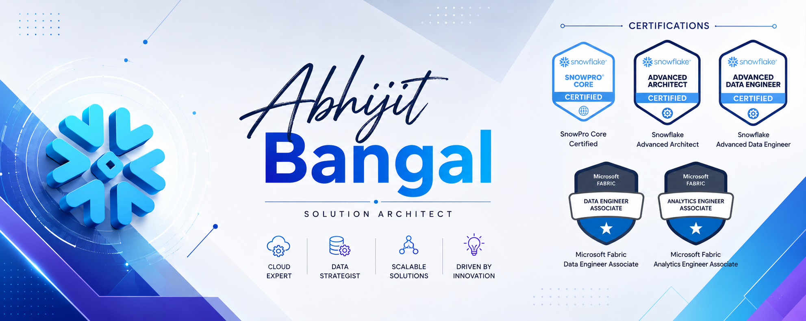

  

## 👋 Hi, I'm Abhijit Bangal

**Solution Architect | Data Strategist | Cloud Analytics**

I am a Data Solution Architect dedicated to designing robust, scalable, and secure data ecosystems. I specialize in architecting modern data platforms using **Snowflake** and **Microsoft Fabric**, helping organizations migrate from legacy systems to unified, high-performing cloud architectures. 

### 🏗️ What I Do
*   **Data Architecture:** Designing end-to-end data platforms spanning ingestion, storage, processing, and visualization.
*   **Snowflake Ecosystems:** Architecting Data Clouds, optimizing virtual warehouses, and implementing secure data sharing.
*   **Microsoft Fabric:** Unifying enterprise data workloads using OneLake, Data Factory.
*   **Strategic Advisory:** Aligning technical data solutions with enterprise business objectives and governance standards.

### 🛠️ Tech Stack & Tools
*   **Core Platforms:** Snowflake, Microsoft Fabric.
*   **Data Engineering:** SQL, Python, dbt, Azure Data Factory
*   **Cloud Providers:** Microsoft Azure, AWS
*   **Architecture Patterns:** Data Mesh, Data Lakehouse, Medallion Architecture

### 📫 Let's Connect
*   **LinkedIn:** [Connect with me on LinkedIn](https://www.linkedin.com/in/abhijit-bangal-8b38b4164/)
*   **Email:** [Reach out via Email](mailto:abhijit.bangal92@gmail.com)
